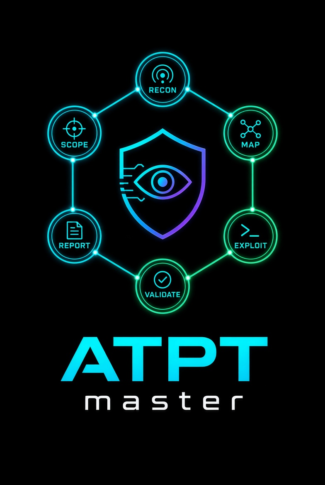
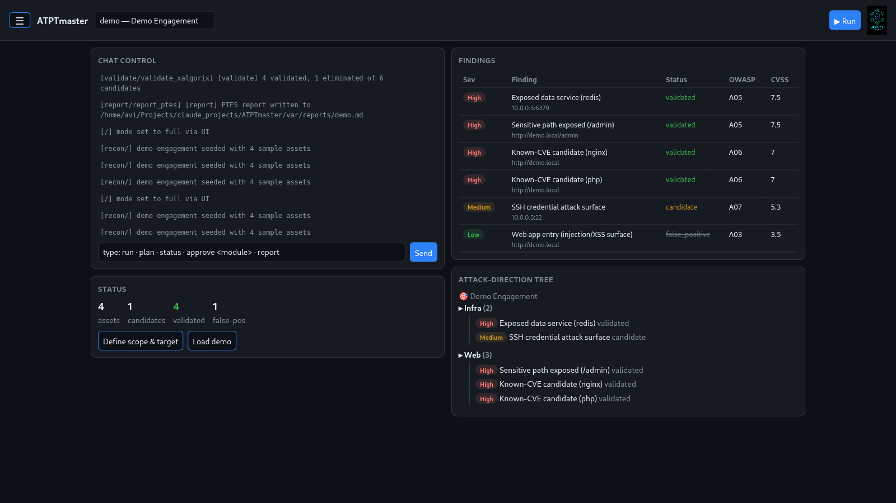
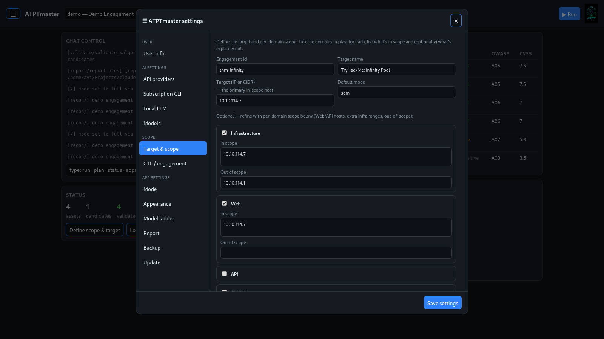
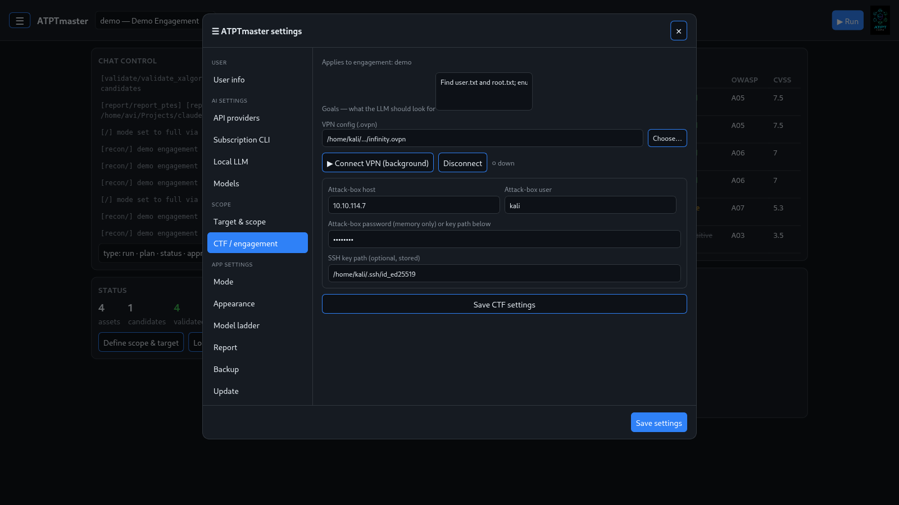
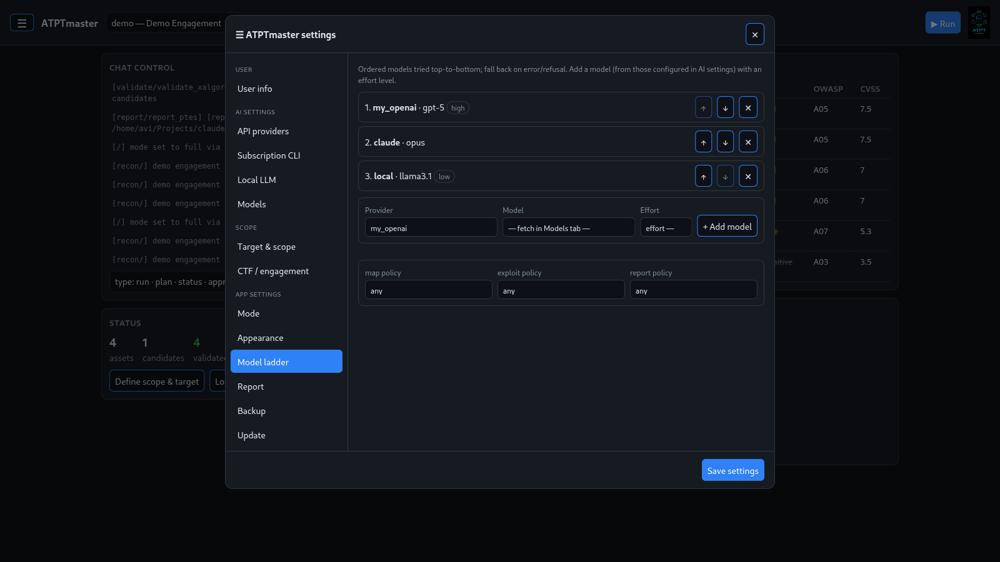
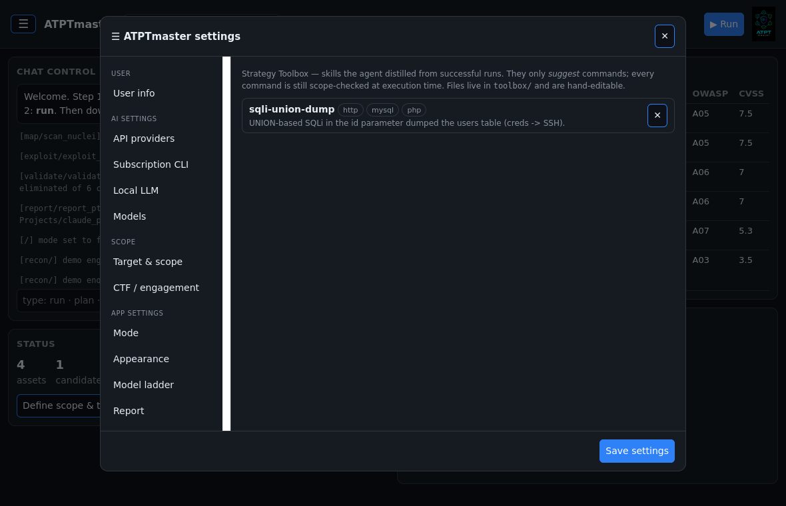

<p align="center">
  
</p>

<p align="center"><em>Autonomous Pentest Framework — by Avi Twil</em></p>

# ATPTmaster

A modular, autonomous **penetration-testing framework** for Kali Linux, driven
entirely from a **web console** — or its **desktop app**. Set your scope, connect
an LLM, press **Run**, and watch findings and an attack-direction tree fill in;
download a **PTES-compliant Markdown report** at the end.

- **Two ways to run the UI** — a browser console (`atpt --u`) or a native desktop
  app (`atpt --app`, or the installed icon).
- **Zero-dependency core** — pure Python stdlib; the desktop window adds one
  optional package and gracefully falls back to a browser window without it.
- **Bring your own LLM** — hosted API key, an existing CLI login, or a local
  Ollama. Each operator uses their own keys; nothing proprietary is bundled.
- **An LLM Director runs the engagement by default** — it drives the scan/exploit
  loop itself, one command at a time, authors each finding as a full write-up, and
  distills each win into a reusable **skill** it reaches for on the next target. The
  classic fixed pipeline is still one click away. Always scope-locked.

> Only test systems you are **authorized** to test. Every intrusive step enforces
> your engagement scope and, in `semi` mode, pauses for your approval.

## Install

Python ≥ 3.10, stdlib only. The one-liner installs the **latest official release**
(stable `vX.Y.Z` tags only — betas are skipped):

```bash
curl -fsSL https://raw.githubusercontent.com/avitwil/ATPTmaster/main/bootstrap.sh | bash
```

Or clone it yourself (add `--branch <vX.Y.Z>` to pin a release):

```bash
git clone https://github.com/avitwil/ATPTmaster.git atpt && cd atpt && ./install.sh
```

The installer puts an `atpt` launcher on your PATH **and adds an ATPTmaster
desktop icon** to your app grid. Add the optional scanners any time with
`./install.sh --with-tools`.

**Updating is one click** — **☰ → App settings → Update** installs the latest
stable release and keeps all your data (engagements, reports, learned skills).
Beta / pre-release tags are never auto-installed.

## Launch the app

```bash
atpt --app     # native desktop window (click the ATPTmaster icon does the same)
atpt --u       # or open the console in your browser → http://127.0.0.1:8787
```

The **desktop app** starts the console on a private local port and opens it in
its own window — no terminal, no browser tab. It stores engagements, uploads and
reports under a per-user data folder (`~/.local/share/ATPTmaster` on Linux,
`~/Library/Application Support/ATPTmaster` on macOS). To build a double-click
installable bundle (Linux binary / macOS `.app`), see
[`packaging/README.md`](packaging/README.md).

Either way you get the same console:



The **logo** sits top-right, a **☰ menu** (top-left) holds all settings, **Run**
is top-right, and the body is **chat + status on the left**, **findings +
attack-direction tree on the right**.

## Using the console — a TryHackMe box, end to end

1. **☰ → Scope → Target & scope.** Give it an id and name, put the box IP in
   **Target (IP or CIDR)**, and tick the domains in play (Infra for the IP, Web if
   there's a site). Each domain takes in-scope and out-of-scope lists — the scope
   oracle enforces both before any intrusive tool touches a host. Pick the
   **Engine** for this engagement — **Director** (LLM drives it, default) or
   **Classic pipeline** (the original fixed scan chain). Instead of filling the
   fields yourself, you can also describe your scope in plain language to the
   **scope agent**; it restates or completes it and writes it only after you
   approve — the deterministic scope wall and startup confirmation still gate
   every scan either way.

   

2. **☰ → Scope → CTF / engagement.** Set the **goals** (injected into the LLM's
   prompts), **pick your `.ovpn`** (a file picker — no path typing), then
   **Connect VPN (background)** to bring the tunnel up. Optionally add an attack-box.

   

3. **☰ → AI settings.** Add a provider (API key, subscription CLI, or Ollama), then
   **☰ → App settings → Model ladder** to order the models to try, each with an
   **effort** level (fetched live in the **Models** panel).

   

4. **☰ → App settings → Mode**, then press **Run** (top-right). It runs in the
   background — the button becomes **⏸ Pause** / **⏹ Stop** (halt at the next step).
   Findings and the attack tree fill in on the right; grab the report from
   **App settings → Report** (customize per-finding notes and screenshots first).

- **Run / Pause / Stop** — Run executes in the background; **⏸ Pause** and **⏹ Stop**
  halt gracefully at the next module boundary (a running scanner finishes first).
  Intrusive steps still gate on approval in `semi` mode.
- **Chat control** — `run` / `plan` / `status` / `approve <module>` / `report`.
- **Findings** table — click a row to open its full write-up (what it is, how it
  was proven, impact, remediation, confidence) plus any attached screenshots —
  and an **attack-direction tree** (grouped by domain, ranked by severity).

## The ☰ menu

Everything is configured in the menu — no JSON editing:

- **User** — name (appears on the report), company, phone, email.
- **AI settings** — *API providers* (paste a key, stored redacted, or name an env
  var read at call time), *Subscription CLI* (Claude / Gemini / Codex, or a custom
  one, with one-click auto-install), *Local LLM* (Ollama), and *Models* (live-fetched
  per provider; a curated list for the subscription CLIs).
- **Scope** — *Target & scope* (domain-typed: Infra / Web / API / AI / Cloud /
  Mobile / Wireless, each with in/out-of-scope lists — or chat with the **scope
  agent**, which restates or elicits a scope and writes it only after you approve)
  and *CTF / engagement* (VPN config, goals, attack-box).
- **App settings** — *Mode* (`step` / `semi` / `full`), *Appearance* (light / dark /
  system, plus **Allow sudo** — password held in memory only), *Model ladder*
  (one **global** ladder of ordered models, each with an effort level, plus optional
  **per-role** overrides for director / OSINT / active recon / skill / scope / map /
  exploit / report — any configured provider can serve any role, nothing is pinned
  to a specific model), *Report* (include/exclude findings, add notes and
  screenshots, then **Download**), and *Toolbox* (the offensive agent's learned
  skills — view service tags and what worked, or delete one).

Provider / model / user / sudo settings are global; scope, CTF and report settings
attach to the selected engagement.

## The Director — the default engine

New engagements default to the **Director**: instead of a fixed scan chain, the LLM
**drives the engagement itself** — proposing one command at a time, reading the
output, and deciding what's next, adapting to what it finds. Pick **Classic
pipeline** on the **Engine** toggle (**☰ → Scope → Target & scope**, at creation) to
fall back to the original fixed scan chain instead; both engines share the same tool
library and the same scope wall.

**Recon runs in two phases.** A passive **OSINT** expert reasons only over context
you provide for the engagement — for a TryHackMe/HackTheBox box that's the
challenge-page text, since there's no public footprint to research — before
**active recon** enumerates in-scope hosts, exactly as before. Paste that context in
**☰ → Scope → CTF / engagement → OSINT context / challenge page**; leave it empty and
the OSINT phase stays a no-op, as before.

**Findings are authored, not just harvested.** When the Director concludes something
is a real issue, it writes it up as a first-class **finding** — title, severity,
what it is, how it was proven, impact, remediation, and its confidence — instead of
a bare "asset found". That write-up is what the findings table's detail view and the
downloaded report both draw from (see the next two sections). Automatic flag/asset
harvesting stays as a safety net alongside it.

It is supervised so it can **never leave scope**:

- **Startup confirmation.** Before it acts, in *every* mode, it shows you the exact
  in-scope targets and waits for your OK — so a typo in the target can't turn into
  scanning the wrong host.
- **Deterministic scope wall.** Every command it proposes is parsed for its target
  and must pass the scope oracle, in `semi` **and** `full`. `full` means no per-step
  human — never "no scope wall." An out-of-scope command is blocked and fed back as
  an observation, and the agent proposes a different in-scope action.
- **Read-only by default.** The allowed tools default to enumeration (nmap, curl,
  gobuster, nuclei, …); exploit tools (sqlmap, hydra, …) are opt-in per engagement.
  Write/egress flags are denied regardless.
- **Bounded + stoppable.** A step budget limits the run; **Stop** halts it (and
  disconnects the VPN).

Discovered services and issues flow into the same map → validate → **PTES report**
pipeline, and every win is distilled into a reusable skill — see the **Strategy
Toolbox** below. See the design in
[`docs/superpowers/specs/2026-09-18-llm-driven-offensive-agent-design.md`](docs/superpowers/specs/2026-09-18-llm-driven-offensive-agent-design.md)
and
[`docs/superpowers/specs/2026-09-19-llm-director-and-rich-findings-design.md`](docs/superpowers/specs/2026-09-19-llm-director-and-rich-findings-design.md).

## Findings — clickable detail + screenshots

Every row in the **findings** table opens a **detail panel** with that finding's
full write-up — description, how it was proven, impact, remediation, confidence,
severity, status, OWASP/CVSS — plus an "Add screenshot" control. Screenshots are
**operator-attached** (there's no auto-capture of target pages); the in-console
panel lists the attached file(s) — inline image display over `http://127.0.0.1` is
a known limitation — while the same screenshots render inline in the **downloaded
PTES report**, since both draw from the one shared screenshot slot in **App
settings → Report**.

## PTES report — LLM-authored narrative, deterministic fallback

The downloaded report's **Executive Summary** and **Methodology** are written by an
LLM from the engagement's real run transcript — a narrative of what was actually
done on *this* target, not boilerplate — while each finding's description,
reproduction, impact and remediation come straight from the Director's write-up
(see above). With no model configured, or if the ladder is exhausted, the report
falls back to the original deterministic template — a PTES report is produced
either way.

## Strategy Toolbox — the agent learns from its wins

The offensive agent keeps a **toolbox of skills**. When a run succeeds — it captures
a flag or confirms a finding — the winning steps are distilled into a reusable
**skill**: a short, tool-generic recipe tagged with the goal and the services it
applies to. On a later target the agent searches the toolbox and injects the
best-matching skills into its prompt as a **learned playbook**, so it reaches for a
proven technique instead of rediscovering it from scratch.



- **Where they live.** One JSON file per skill under your data home
  (`~/.local/share/ATPTmaster/toolbox/*.json` — the **desktop app**'s location; on a
  source checkout, e.g. `atpt --u`/`serve` — including the install.sh path, which
  pins `ATPT_HOME` to the checkout — it's `<project home>/toolbox/` instead) —
  hand-editable and portable. Share a skill by dropping its file in; the agent
  indexes it on the next run.
- **Operator-visible.** **☰ → App settings → Toolbox** lists every skill with its
  service tags and what worked, each with a **Delete** control. A skill records its
  `name`, `applies_to` (goal / service tags), `steps` (argv templated with
  placeholders like `{TARGET}`), a one-line `success_note`, and its provenance.
- **Suggestions, never authority.** A skill only *suggests* commands. Every command
  the agent runs — learned or not — still passes the deterministic scope wall and the
  tool allowlist at execution time, so a shared or hand-edited skill can **never widen
  your scope** or unlock a new tool; at worst a bad suggestion is blocked.

Nothing to configure: the toolbox fills itself as you run the agent, and grows more
useful the more engagements you run.

## Under the hood

The engine, module contract, the 11 shipped capability modules (recon → map →
exploit → validate → report), the scope oracle, and the LLM provider ladder are
documented in [`docs/CORE.md`](docs/CORE.md). Design specs and implementation
plans live under [`docs/superpowers/`](docs/superpowers/). The console binds to
`127.0.0.1` and has no authentication — it's an operator tool, don't expose it.

## License

Licensed under the **Apache License 2.0** — see [`LICENSE`](LICENSE). © 2026 Avi Twil.
Bundled third-party tools under `tools/` retain their own upstream licenses.
